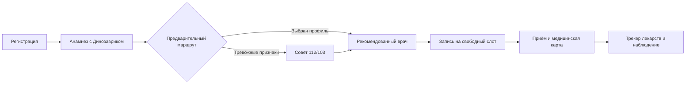
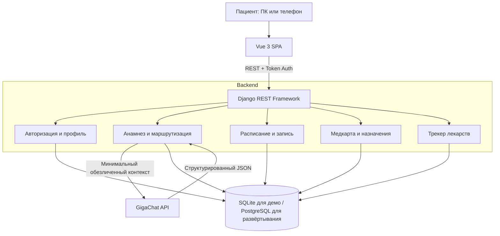

# DИИnozavr

DИИnozavr — единый цифровой помощник многопрофильной клиники с усиленным ЛОР-направлением. Пациент проходит путь от регистрации и адаптивного сбора анамнеза до выбора профильного врача, записи, медицинской карты и контроля назначений в одном интерфейсе. MVP сокращает рутинную часть первичного приёма и помогает не занимать время терапевта, когда жалоба уже соответствует конкретному специалисту; окончательное медицинское решение всегда остаётся за врачом.

> Проект команды «Пижама с динозаврами», созданный как MVP для хакатона за 2,5 дня.

## Путь пациента



ИИ задаёт по одному уточняющему вопросу, формирует краткое резюме и выбирает только одну специальность из каталога клиники. Конкретного врача назначает backend по данным собственной базы — GigaChat не имеет прямого доступа к ней и не может выдумать врача. При тревожных признаках пациент сначала получает рекомендацию обратиться за экстренной помощью, но может завершить опрос и перейти к плановой записи.

## Архитектура



### Почему система разделена именно так

- **Vue 3** отвечает за адаптивный пользовательский интерфейс: лендинг, чат, запись, кабинет и трекер.
- **Django REST Framework** хранит пользователей и медицинские сущности, проверяет права доступа и выполняет бизнес-логику.
- **GigaChat-3-Ultra** получает только медицински значимый контекст, задаёт следующий вопрос и предлагает специальность. Email, телефон, ФИО и номер полиса модели не передаются.
- **Слой маршрутизации Django** проверяет специальность, при неизвестном ответе безопасно направляет к терапевту и выбирает существующего доступного врача с учётом нагрузки и стажа.
- **SQLite** позволяет запустить MVP без инфраструктуры. Для пилота конфигурация уже поддерживает PostgreSQL через переменные окружения.

## Возможности MVP

| Модуль | Что реализовано |
|---|---|
| Регистрация и вход | Пациентская и административная роли, токен-авторизация, данные профиля используются повторно |
| Динозавр-аватар | Случайная композиция из 16 фонов и 9 динозавров создаётся один раз при регистрации |
| Анамнез | Адаптивный диалог через GigaChat, медицинский системный промпт, контроль структуры ответа и тревожных признаков |
| Маршрутизация | 10 специальностей, 15 врачей; результат опроса открывает форму записи с рекомендованным врачом |
| Запись | Календарь по неделям, получасовые интервалы 08:00–20:30, занятые и недоступные слоты отключены |
| Медицинская карта | Последние события, справки, анализы, исследования и протоколы приёмов |
| Трекер лекарств | Расписание приёма и отметка выполненных назначений |
| Поддержка | Контактные данные автоматически берутся из профиля авторизованного пациента |
| Администрирование | Сводные показатели и Django Admin для управления данными |

## Навигация по репозиторию

```text
clinic-assistant/
├── backend/
│   ├── api/
│   │   ├── migrations/               # схема БД и демонстрационный каталог врачей
│   │   ├── prompts/medical_assistant.txt # системный медицинский промпт
│   │   ├── services/                 # GigaChat, safety-правила и разбор ответа
│   │   ├── models.py                 # доменные сущности
│   │   ├── serializers.py            # API-представление и валидация
│   │   ├── views.py                  # endpoints и бизнес-логика
│   │   └── tests.py                  # backend-тесты
│   ├── config/                       # настройки и корневые URL Django
│   ├── database.dbml                 # исходная концептуальная схема данных
│   ├── .env.example                  # безопасный шаблон настроек
│   └── manage.py
├── frontend/
│   ├── public/avatars/               # фоны, динозавры и аватар помощника
│   ├── src/
│   │   ├── components/               # общие UI-компоненты
│   │   ├── views/                    # страницы приложения
│   │   ├── services/api.js           # обёртка над REST API
│   │   ├── stores/auth.js            # состояние авторизации
│   │   └── assets/styles.css         # адаптивные стили
│   └── vite.config.js                # dev-сервер и прокси /api
└── README.md
```

## Модули подробнее

### Анамнез и маршрутизация

`frontend/src/views/AnamnesisView.vue` ведёт диалог и показывает итоговый маршрут. Endpoint `POST /api/anamnesis/chat/` сохраняет сообщения в приватной сессии, а `backend/api/services/anamnesis.py` формирует минимальный контекст, вызывает GigaChat и валидирует JSON по строгой схеме.

Системный промпт запрещает ставить диагноз, назначать или отменять препараты, запрашивать известные контакты и завершать экстренный сценарий без маршрута. После выбора специальности backend сопоставляет её с каталогом и возвращает объект `recommended_doctor`; форма записи получает специальность и ID врача через параметры URL.

### Расписание и запись

`frontend/src/views/AppointmentView.vue` показывает карточку врача без фотографии: ФИО, специальность, стаж и профиль работы. Endpoint `GET /api/availability/` строит календарь на 7 дней, хранит созданные слоты в базе и помечает прошедшие, занятые и нерабочие интервалы как недоступные. Создание записи выполняется транзакционно, чтобы один слот нельзя было занять дважды.

### Профиль и медкарта

Контакты пациента хранятся в `PatientProfile` и автоматически используются при записи и обращении в поддержку. Медкарта объединяет события, электронные справки, результаты анализов и исследований, а также заключения врачей. Динозавр и фон аватара выбираются при создании профиля и не меняются при его редактировании.

### Трекер лекарств

Трекер хранит препарат, дозировку, расписание, следующий приём и состояние курса. В дальнейшей версии назначения из протокола врача смогут предлагаться пациенту для добавления в трекер после подтверждения.

## Быстрый запуск

Требуются Python 3.11+ и Node.js 20+ с `pnpm`.

### Backend

```bash
cd backend
python -m venv .venv
source .venv/bin/activate
pip install -r requirements.txt
cp .env.example .env
python manage.py migrate
python manage.py runserver
```

### Frontend

В отдельном терминале:

```bash
cd frontend
pnpm install
pnpm dev
```

- приложение: `http://localhost:5173`
- REST API: `http://localhost:8000/api/`
- Django Admin: `http://localhost:8000/admin/`

Для администратора: `cd backend && .venv/bin/python manage.py createsuperuser`.

## Настройка GigaChat

Запросы выполняются только сервером. Не вставляйте authorization key во frontend, Git или README. Предпочтительный вариант — отдельный локальный файл:

```dotenv
# backend/.env
GIGACHAT_CREDENTIALS=
GIGACHAT_CREDENTIALS_FILE=.gigachat_credentials
GIGACHAT_SCOPE=GIGACHAT_API_PERS
GIGACHAT_MODEL=GigaChat-3-Ultra
GIGACHAT_MOCK=0
GIGACHAT_FALLBACK_TO_MOCK=0
GIGACHAT_VERIFY_SSL=1
GIGACHAT_CA_BUNDLE=certs/russian_trusted_root_ca_pem.crt
```

Поместите authorization key единственной строкой в `backend/.gigachat_credentials` и перезапустите Django. `.env`, `.gigachat_credentials` и локальная база исключены из репозитория и итоговой сборки. Для автономной демонстрации без интернета установите `GIGACHAT_MOCK=1`; это предсказуемый demo-сценарий, не предназначенный для медицинского использования.

## База данных

По умолчанию используется SQLite. Чтобы переключиться на PostgreSQL, заполните в `backend/.env`:

```dotenv
POSTGRES_DB=diinozavr
POSTGRES_USER=diinozavr
POSTGRES_PASSWORD=change-me
POSTGRES_HOST=localhost
POSTGRES_PORT=5432
```

Django ORM и миграции одинаково работают с обеими СУБД. Основные связи: пользователь → профиль → записи/медкарта/лекарства; специальность → врачи → слоты → приёмы → назначения → препараты.

## Основные API endpoints

| Метод | Путь | Назначение |
|---|---|---|
| `POST` | `/api/auth/register/` | регистрация пациента |
| `POST` | `/api/auth/login/` | вход и получение токена |
| `GET/PATCH` | `/api/auth/me/` | профиль текущего пользователя |
| `GET` | `/api/specialties/` | каталог специальностей |
| `GET` | `/api/doctors/` | каталог доступных врачей |
| `POST` | `/api/anamnesis/chat/` | очередной шаг опроса |
| `GET` | `/api/availability/` | расписание выбранного врача |
| `GET/POST` | `/api/appointments/` | записи текущего пациента |
| `GET` | `/api/medical-records/` | медицинская карта |
| `GET/POST/PATCH` | `/api/medications/` | трекер лекарств |

## Проверка проекта

```bash
cd backend
.venv/bin/python manage.py test

cd ../frontend
pnpm build
```

## Демонстрационный сценарий

1. Зарегистрировать пациента и показать автоматически созданный аватар.
2. Открыть «Анамнез», описать жалобу и ответить на уточняющие вопросы.
3. Показать специальность и рекомендованного реального врача из базы.
4. Перейти в предзаполненную форму, раскрыть карточку врача и выбрать свободный слот.
5. Открыть личный кабинет, медкарту и трекер лекарств.

## Гипотеза и метрики пилота

Гипотеза проекта: структурированный анамнез до визита и автоматическая маршрутизация уменьшают долю ошибочных записей и время врача на сбор базовой информации без заметного снижения качества помощи. Для проверки на пилоте нужны: доля успешных завершений опроса, совпадение рекомендованного профиля с решением врача, средняя длительность первичного приёма, доля перезаписей к другому специалисту, no-show rate и соблюдение графика лекарств.

## Ограничения и безопасность

- сервис не ставит диагноз и не заменяет врача;
- при тревожных признаках приоритетом остаются 112/103 и экстренная помощь;
- до промышленного запуска необходимы клиническая валидация, информированное согласие, аудит безопасности и юридическая проверка обработки медицинских данных;
- демонстрационные врачи и медицинские записи вымышлены;
- секреты и персональные данные нельзя отправлять в публичные репозитории или логи.

## Следующие шаги

1. Провести пилот на обезличенных сценариях и измерить точность маршрутизации.
2. Добавить подтверждение рекомендации врачом и обратную связь для улучшения правил.
3. Перенести рабочую базу на PostgreSQL, внедрить журнал аудита и разграничение доступа.
4. Связать назначения врача с трекером лекарств и напоминаниями.
5. Выпустить мобильное приложение поверх того же REST API.
